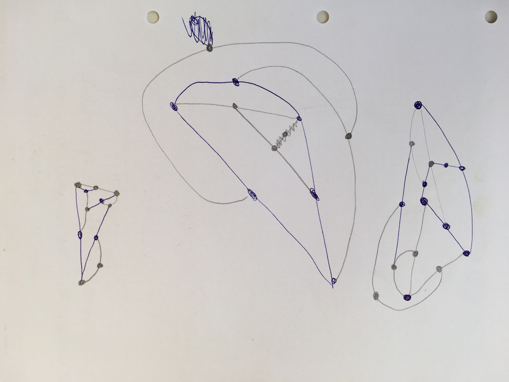
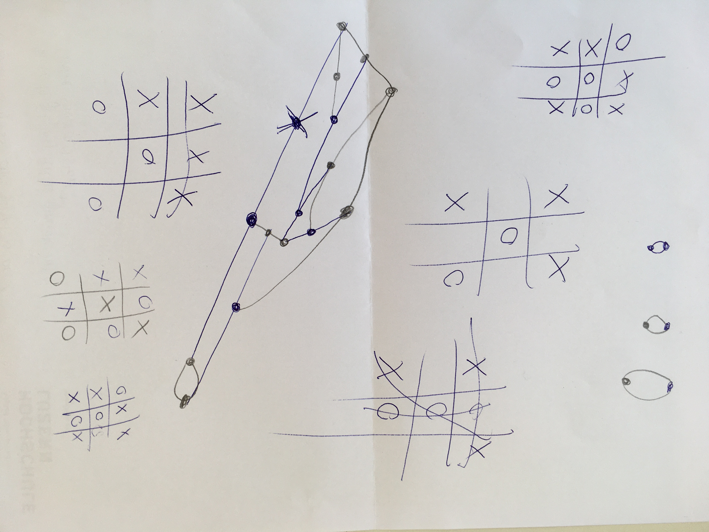

# Day 01

## || 29.09.21

Day one was fun.

### Task 01

Played a game named "Sprouts" with Neela and Guiliana. But could't find out a tatic to win. Afterwards we started to play TicTacToe to test some tactics. We also found out that there is a 3D TicTacToe which we like to try.

---

### Task 02

Set up my repo and learned more about markdown, still have to do more researches.
Started playing with shapes in P5.

<iframe src="../content/day01/01/embed.html" width="100%" height="450" frameborder="no"></iframe>

<iframe src="../content/day01/02/embed.html" width="100%" height="450" frameborder="no"></iframe>

<iframe src="../content/day01/03/embed.html" width="100%" height="450" frameborder="no"></iframe>
