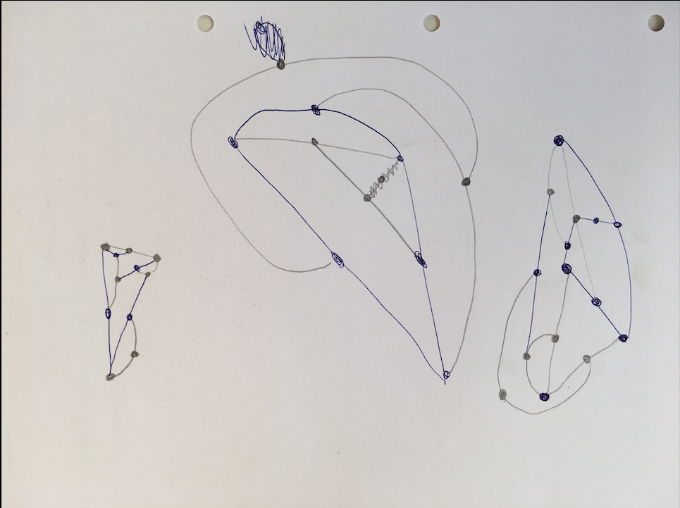
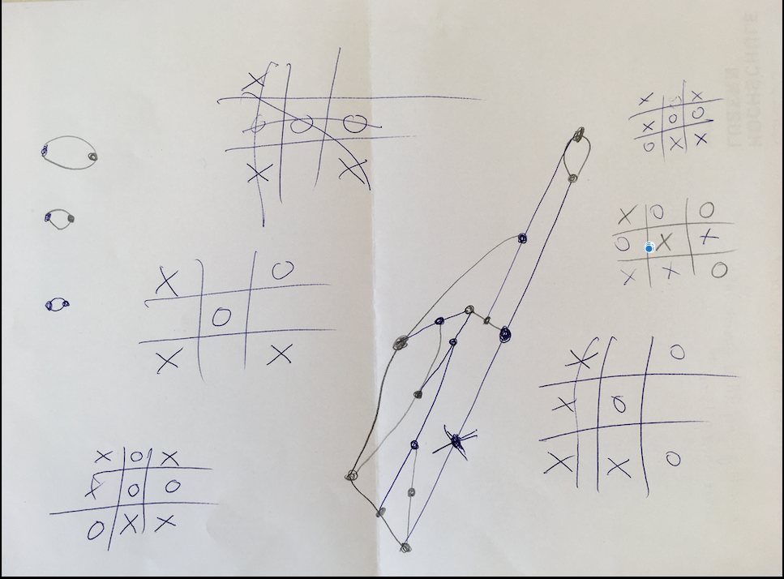
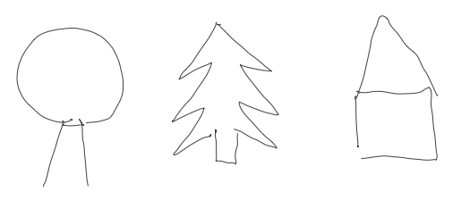
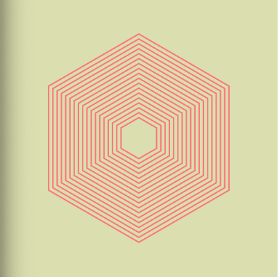
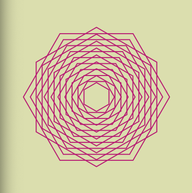
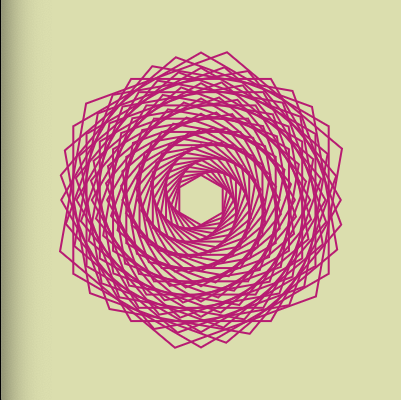

# Day 01 

##### || 29.09.21 - Day one was fun.

## Game

After an intro about Generative Art we started with a game name "Sprouts". We tried to find out a tatic to always win, but it was quite difficult. Due discussing about strategies we came accross "TicTacToe". In this game it was much easier to find a win strategy, so we startet to look around if there are other options to make it more difficult. There are many other options for example "3D TicTacToe", which sounds very interesting to try.

Our results:

Rules:
<https://nrich.maths.org/2413>

---

## Setup

Before we jumped into sketching, coding and creating we set up our repo in class and I got in touch with markdown the first time. I decided to write my journal in markdown because I can use it with GitHub Pages and it's very convenient for me to have everything organized and on one place. How I will get along with it, we will see the next few days/weeks.

---

## Task 1 - Draw then code

For the warm up we could decide how we wanted to start with p5.js. Because my p5.js knowledge is not that present anymore I chose a simple task to draw shapes, to get into coding again. In this task we had to sketch on paper first before we got into coding. For me it's always very difficult if i sketch something and then code, but it was a good challenge for me to start with.

Somehowe I got inspired by "Santas Home" and made a sketch with two trees to symbolise the forest and a small house where Santa live.

<iframe src="../content/day01/01/embed.html" width="100%" height="450" frameborder="no"></iframe>

---

## Task 2 - Shapes

For my second project I made hexagons and tried out some rotations with it.

<iframe src="../content/day01/02/embed.html" width="100%" height="450" frameborder="no"></iframe>

---

## Task 3 - Iteration + randomness

Made a grid whith rectangles which i have random darker blue shades colors. It remains me of a LED wall in a darker club to give the beats and vibes.

<iframe src="../content/day01/03/embed.html" width="100%" height="450" frameborder="no"></iframe>

