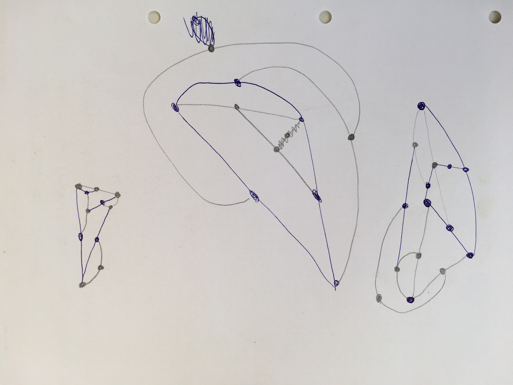
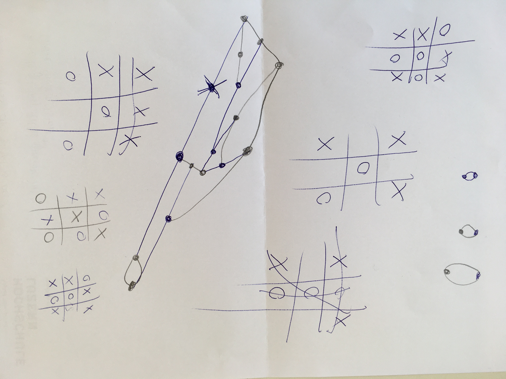
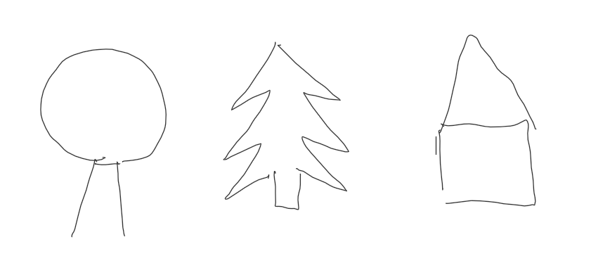

# Day 01

## || 29.09.21

Day one was fun.

### Game

Played a game named "Sprouts" with Neela and Giuliana. We tried to find out a tatic to always win, but it was quite difficult. Due discussing about tatics we came accross TicTacToe. After a while it was easier to find a strategy to win than on the other game. We also found out that, there is a 3D TicTacToe which sounds very interesting and we like to try out.

---

### Setup

Set up my repo in class and got in touch first time with markdown. I decided to write my journal in markdown because I can use it with GitHub Pages and it's very convenient for me to have everything organized at one place. How I will get along with it the next few week.

---

### Task 1 - Draw then code

To start with P5 JS, our first task was to make a simple sketch before writing the code.

My got inspired by "Santas Home" and made a sketch with two trees to symbolise the forest and a small house where Santa live.

<iframe src="../content/day01/01/embed.html" width="100%" height="450" frameborder="no"></iframe>

---

### Task 2 - Iteration + randomness

Made a grid whith rectangles which i have random darker blue shades colors. It remains me of a LED wall in a darker club to give the beats and vibes.

<iframe src="../content/day01/02/embed.html" width="100%" height="450" frameborder="no"></iframe>

This is a result just from playing around and try stuff out.

<iframe src="../content/day01/03/embed.html" width="100%" height="450" frameborder="no"></iframe>
