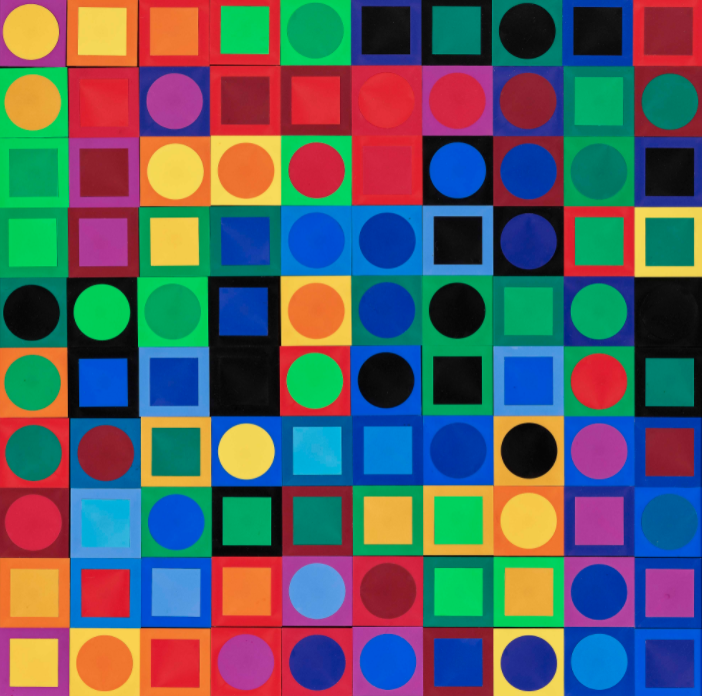

# Day 02 

##### || 30.09.21

## Iterative Patterns

### Grid - Matches

simple matches

<iframe src="../content/day02/01/embed.html" width="100%" height="450" frameborder="no"></iframe>

---

### Patterns

Sketched a pattern which is made with circles.

Notes: Could extend that in different colors and play with sizes.

Wasn't very inspired to work on this further so decided to play around with other stuff.

<iframe src="../content/day02/02/embed.html" width="100%" height="450" frameborder="no"></iframe>
<iframe src="../content/day02/03/embed.html" width="100%" height="450" frameborder="no"></iframe>

---

### noName

<iframe src="../content/day02/04/embed.html" width="100%" height="450" frameborder="no"></iframe>

---

### more Stuff

Inspired by Victor Vasarely

My version is more minimialistic. I only defiend three colors, just because I don't want to have it that colorful and I only work with rect as outline and with ellipse inline.

<iframe src="../content/day02/05/embed.html" width="100%" height="450" frameborder="no"></iframe>

