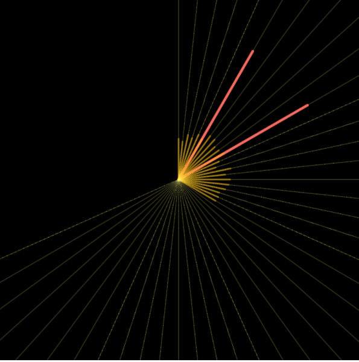
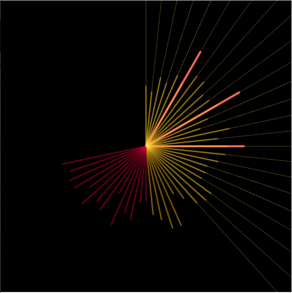

# Day 03

## || 01.10.21

### Clock

#### Ideas:

Particle fall down and the time will show up in container. Every minute particle fall down to the bottom and after one hour bottom will be empty again.

The stack will fill up every hour and minutes.

Every hour more points got fill to show the time.

#### Clocck Numero Uno

Hours: Inner Strokes
Minutes: Middel Strokes
Seconds: Outside Strokes

<iframe src="../content/day03/clock/embed.html" width="100%" height="450" frameborder="no"></iframe>

Example will other colors.

#### Clock Numero Dos

Hours: As strokes in the middle.
Minutes: orange circles
Seconds: outer circles

<iframe src="../content/day03/clock02/embed.html" width="100%" height="450" frameborder="no"></iframe>
