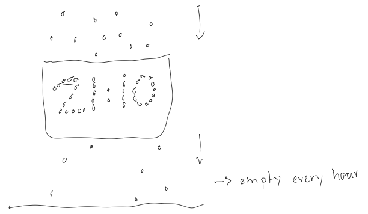
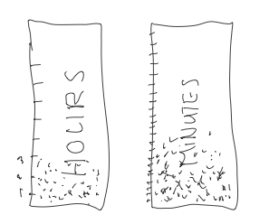
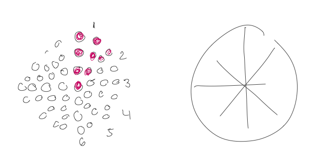

# Day 03 

##### || 01.10.21

## Clock

### Ideas:

Particles fall down and the time will show up in a container. Every minute particles fall down from the container to the bottom and after one hour bottom will be empty again.

The stack will fill up every hour and minutes.

Every hour more points got fill to show the time.

---

### Clock Numero Uno

Well there were a lot of physical inspirations but to transfer this to code was too difficult for me (at this point - hopefully later, one day). So I decided to make it very simple for me. 

- Hours: Inner Strokes
- Minutes: Middel Strokes
- Seconds: Outside Strokes

<iframe src="../content/day03/clock/embed.html" width="100%" height="450" frameborder="no"></iframe>

Example will other colors:

Notes: The idea was also to change colors for am and pm. 

---

### Clock Numero Dos

- Hours: As strokes in the middle.
- Minutes: orange circles
- Seconds: outer circles

<iframe src="../content/day03/clock02/embed.html" width="100%" height="450" frameborder="no"></iframe>
