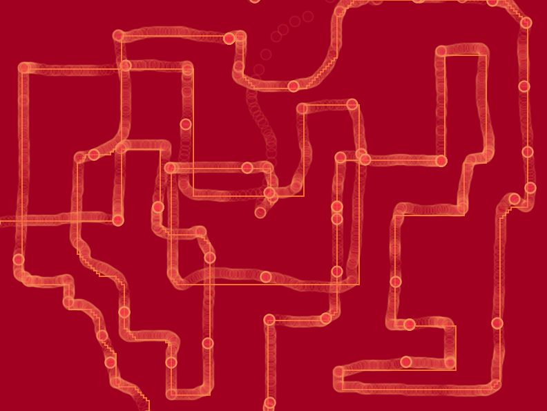
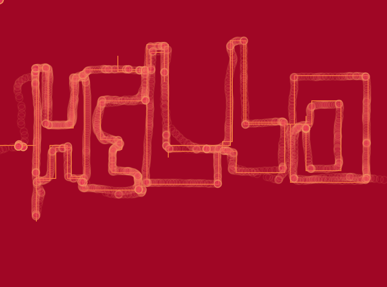
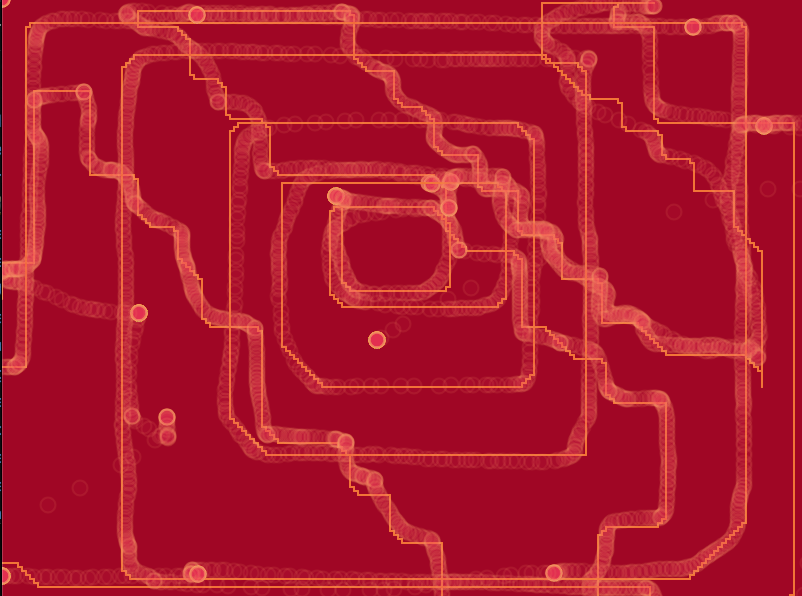

# Day 04

## || 06.10.21

## DRAWING MACHINE

### Hot Wire

GOAL: Create TOGETHER-its BETTER.

OPTION ONE:
Create together something.

OPTION TWO:
PlayerOne(Keyboard): Controll the lines with the arrow keyboard.
PlayerTwo(Mouse): Follow PlayerOne's line with the mouse as good as possible.
Extended: PlayerTwo with mouse goes first and PlayerOne follows.

Idea: My idea was to create a drawing machine which two person can create. The idea is from the game Hot Wire.

<iframe src="../content/day04/01/embed.html" width="100%" height="450" frameborder="no"></iframe>





---

<<<<<<< HEAD
### MicInput
I wanted to do something where I can include the micinput. But it wasn't easy to find something to do 

<iframe src="../content/day04/02/embed.html" width="100%" height="600" frameborder="no"></iframe>
=======
### CLAP

In this project i want to do something with a ineraction so I decided to try out something wiht mic input. 
Out of the microphon level I created the size of the circle. 

<iframe src="../content/day04/02/embed.html" width="100%" height="450" frameborder="no"></iframe>
>>>>>>> 65c2c1fe8b11cc0a11dd9f0c4914ceb8a53411b0


```js
function draw() {
  var micLevel = 0;
  var micLevel = mic.getLevel();
  console.log(micLevel);
  var sd = micLevel * 100;
  var md = micLevel * 300;
  var pd = micLevel * 500;
  ```js

---
