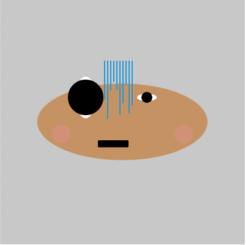
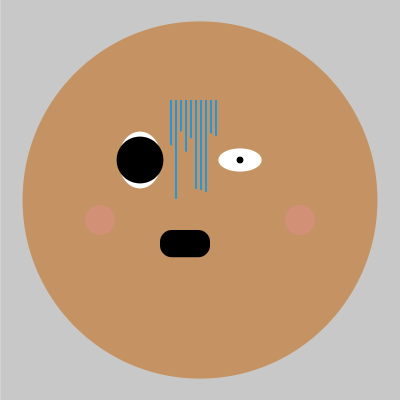
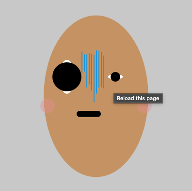
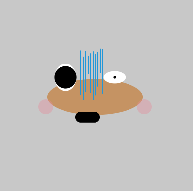
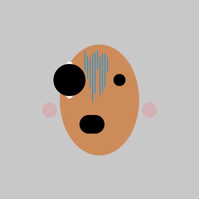
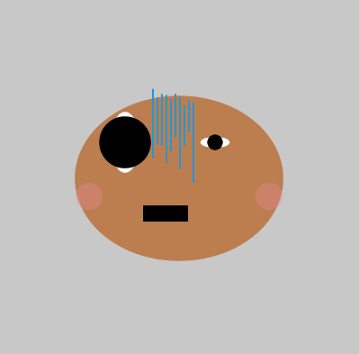
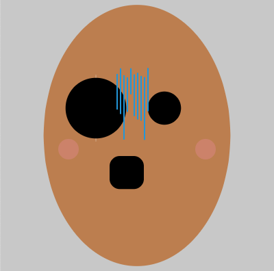
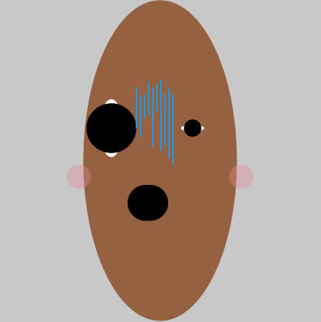
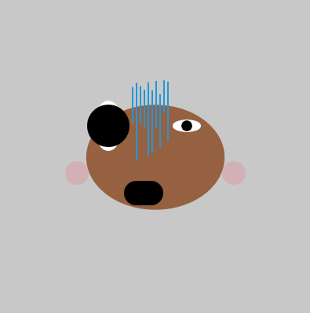

# Day 05 

##### || 07.10.21

## Face Generator

### Mr. Potato

My intention was to make a face generator which makes cute faces. They should include hair and cheeks. Later on I came up with the idea with Mr. Potato Head ...

Notes: Next step grid with all the faces and more parameters.

<iframe src="../content/day05/01/embed.html" width="100%" height="450" frameborder="no"></iframe>

