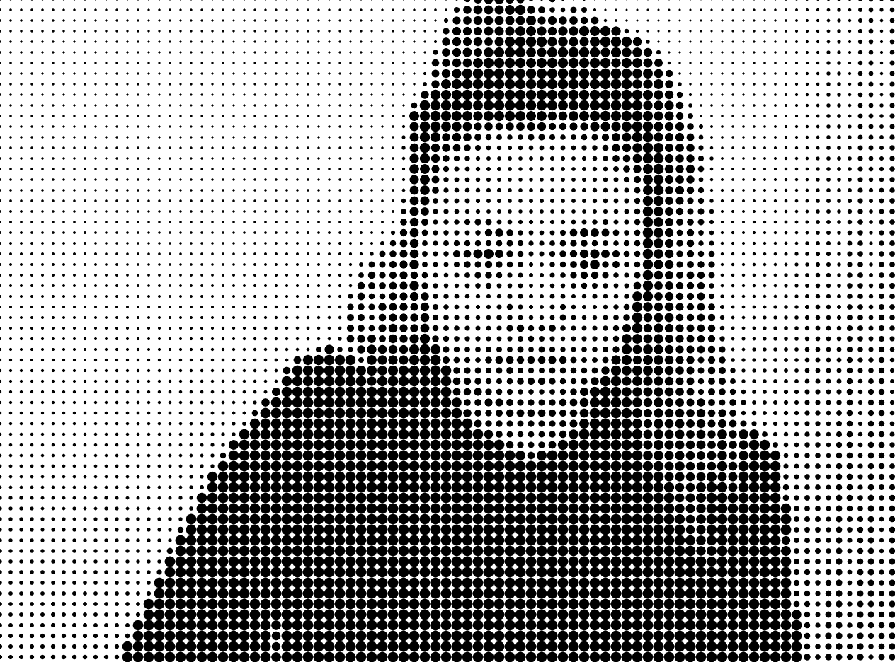
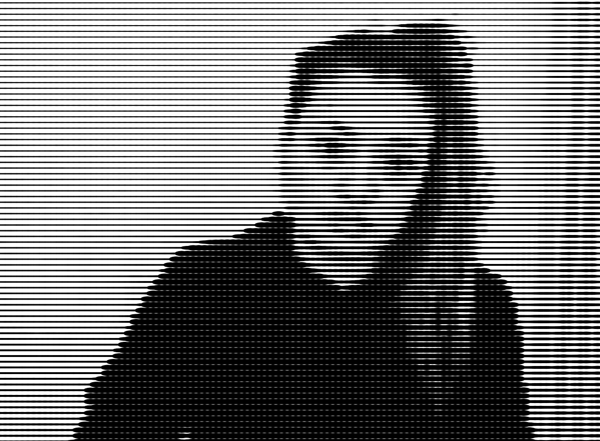
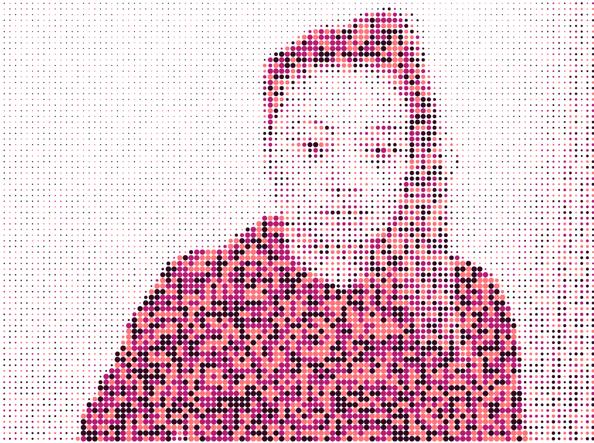

# Day 06 

##### || 08.10.21

## Pixels

It's pixel day..
 My idea was to do something with my camera input.
In the first example the pixels shows up randomly. 

<iframe src="../content/day06/01/embed.html" width="100%" height="450" frameborder="no"></iframe>

Actually I wanted to try that the pixels show up one by one after each other. But I could only managed that it shows up in rows, because I didn't focus on working on this project.
<iframe src="../content/day06/02/embed.html" width="100%" height="450" frameborder="no"></iframe>

At least I tried out to put on every pixels that catches from the camera to show it as a point in different sizes and colors. If the pixel is bright the circles or shapes are small and getting bigger when its darker.

<iframe src="../content/day06/03/embed.html" width="100%" height="450" frameborder="no"></iframe>

